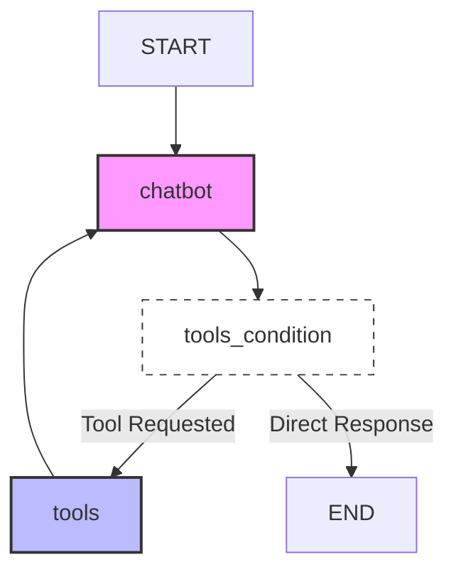

# LangGraph Chatbot Implementation

## Abstract

This project demonstrates the implementation of stateful conversational agents using **LangGraph** and **LangChain**. It progresses from a foundational chatbot that maintains conversation history to a more advanced agent capable of utilizing external tools to fetch real-time information. The system leverages OpenAI's `gpt-4o-mini` model and `StateGraph` workflows to manage complex interaction patterns.

## 1. Introduction

Maintaining state and context is crucial for building effective Large Language Model (LLM) applications. **LangGraph** facilitates this by modeling application logic as a graph, where nodes represent processing steps and edges define data flow. This repository contains two key implementations:

1.  **Basic Chatbot**: A stateful agent that remembers conversation history.
2.  **Tool-Augmented Chatbot**: An advanced agent that can query external sources (Wikipedia, Arxiv) to answer questions beyond its training data.

## 2. Project 1: Basic Stateful Chatbot

_Source: `02.chatbot.ipynb`_

### 2.1. Technical Architecture

The core architecture uses a `StateGraph` with a single processing node.

- **State**: A `TypedDict` containing a list of messages.
- **Node**: `chatbot` - Invokes the LLM with the current message history.
- **Edge**: Linear flow `START -> chatbot -> END`.

### 2.2. Graph Visualization


## 3. Project 2: Chatbot with External Tools

_Source: `03.chat_external_tools.ipynb`_

### 3.1. Overview

This project extends the basic chatbot by integrating external tools. The agent can decide whether to answer directly or use a tool to gather more information.

### 3.2. Key Components

- **Tools**:
  - `WikipediaQueryRun`: Searches Wikipedia for general knowledge.
  - `ArxivQueryRun`: Searches Arxiv for scientific papers.
- **ToolNode**: A prebuilt node that executes the selected tools.
- **Conditional Logic**: The graph checks if the LLM requested a tool call.
  - If **Yes**: Route to `tools` node.
  - If **No**: Route to `END`.

### 3.3. Graph Visualization



## 4. Prerequisites

- **Python**: Version 3.10 or higher.
- **API Keys**:
  - `OPENAI_API_KEY`: For the LLM.
  - `LANGCHAIN_API_KEY`: For LangSmith tracing (optional).
  - `HF_TOKEN`, `NEO4J_URI` etc. (if using specific extensions).

## 5. Installation

1.  **Clone the Repository** (or download notebooks).
2.  **Create a Virtual Environment**:
    ```bash
    python -m venv .venv
    source .venv/bin/activate  # Windows: .venv\Scripts\activate
    ```
3.  **Install Dependencies**:
    ```bash
    pip install langchain-openai langgraph python-dotenv ipykernel langchain-community wikipedia arxiv
    ```

## 6. Configuration

Create a `.env` file in the root directory:

```env
OPENAI_API_KEY=your_key_here
LANGCHAIN_API_KEY=your_key_here
LANGCHAIN_TRACING_V2=true
LANGCHAIN_PROJECT=your_project_name
```

## 7. Usage

### Running the Basic Chatbot

1.  Open `02.chatbot.ipynb`.
2.  Run all cells to initialize the graph and interact with the bot.

### Running the Tool-Augmented Chatbot

1.  Open `03.chat_external_tools.ipynb`.
2.  Run the cells to bind tools (Wikipedia, Arxiv) to the LLM.
3.  Interact with the bot. Try asking questions like _"What is ZCA?"_ to trigger a tool call.

## 8. Code Structure Analysis

### State Management

Both projects use a shared state definition:

```python
class State(TypedDict):
    messages: Annotated[list, add_messages]
```

The `add_messages` reducer ensures that new interactions are appended to the history rather than replacing it.

### Tool Integration (Project 2)

The integration is achieved via `bind_tools`:

```python
llm_with_tools = llm.bind_tools(tools=tools)
```

This allows the model to emit structured tool calls, which are then intercepted by the graph's conditional logic.
